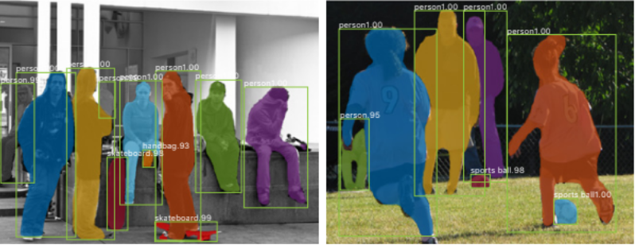
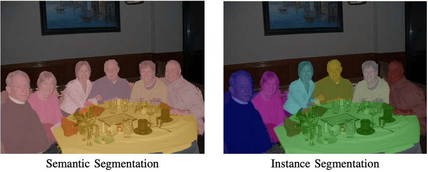
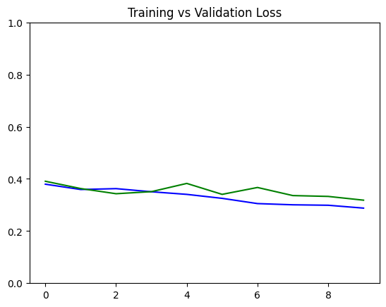
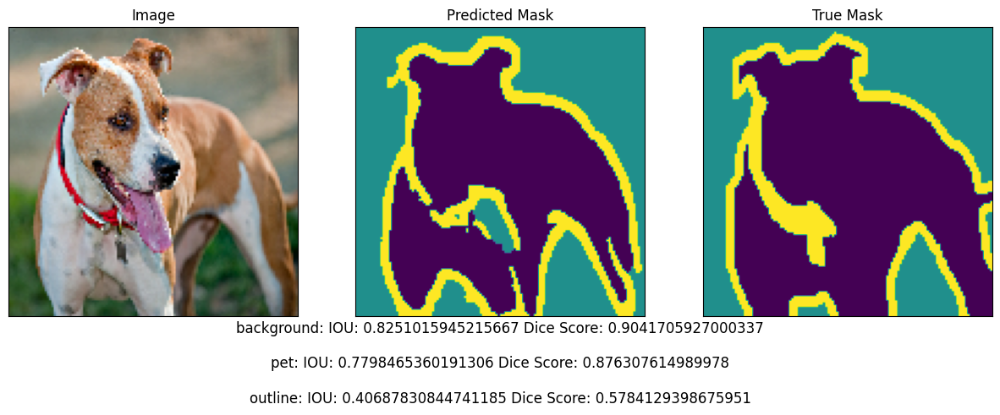

# Image Segmentation using Mask R-CNN and U-Net
Image segmentation is a fundamental task in computer vision that involves partitioning an image into multiple segments or regions, each of which corresponds to different objects or parts ofobjects. The primary goal of image segmentation is to simplify the representation of an image and make it more meaningful and easier to analyze.
## Description
This project demonstrates image segmentation using Mask R-CNN and U-Net. The models are applied to segment objects in various images, highlighting their applications in fields such as medical imaging and autonomous driving.
## Table of Contents

- [Types of Image Segmentation](#Types-of-Image-Segmentation)
  - [Semantic Segmentation](#Semantic-Segmentation)
  - [Instance Segmentation](#Instance-Segmentation)
- [Practical Advantages](#Practical-Advantages)
  - [Mask R-CNN](#Mask-RCNN)
  - [U-Net](#U-Net)
  - [Comnined Advantages](#Combined-Advantages)

## Types of Image Segmentation
### Semantic Segmentation 
- **Definition**: Assigns a label to each pixel in the image, classifying each pixel into a predefined category. All pixels belonging to the same class are given the same label.
- **Applications**: 
  - **Autonomous Driving**: Identifying different elements such as roads, vehicles, pedestrians, and traffic signs.
  - **Medical Imaging**: Segmenting different anatomical structures like organs, tissues, and tumors.
  - **Satellite Imagery**: Classifying land cover types like forests, water bodies, and urban areas.
- **Example**: Segmenting an image of a street scene into classes such as road, cars, pedestrians, and buildings.
  


### Instance Segmentation
- **Definition**: Extends semantic segmentation by distinguishing between different instances of the same class. Each object instance is segmented separately.
- **Applications**:
  - **Object Detection**: Identifying and segmenting each object in an image individually, useful in inventory management and robotics.
  - **Video Surveillance**: Tracking individual objects or people in real-time for security purposes.
  - **Medical Imaging**: Separating overlapping cells in microscopy images.
- **Example**: Segmenting each person in a crowd as a separate entity, not just as part of the 'person' class.





## Practical Advantages

### Mask R-CNN

- **Accurate Object Detection and Segmentation**: Mask R-CNN excels in tasks that require both object detection and segmentation. It can accurately identify and delineate multiple objects within an image, making it ideal for complex scenes with overlapping objects.
  
- **Real-time Applications**: Mask R-CNN is efficient enough to be used in real-time applications such as autonomous driving and video surveillance. It can detect and segment objects on-the-fly, providing critical information for decision-making processes.

- **Handling Occlusions**: Mask R-CNN can effectively handle occlusions and partial visibility of objects. This capability is crucial in scenarios like crowd monitoring and autonomous navigation where objects often overlap.

- **Versatility in Various Domains**: The architecture of Mask R-CNN makes it versatile for various domains, including security (for detecting intruders), retail (for inventory management), and healthcare (for identifying anomalies in medical images).

### U-Net

- **Superior Performance in Medical Imaging**: U-Net is particularly renowned for its performance in medical image segmentation. It has been extensively used for segmenting medical scans, such as MRI and CT images, helping in the diagnosis and treatment planning of diseases like cancer.
  
- **High Precision with Limited Data**: U-Net is designed to work well even with limited annotated data, which is often the case in medical and biological research. Its architecture, which combines high-resolution features with contextual information, ensures high precision in segmentation tasks.

- **Flexible Architecture for Various Applications**: U-Net’s architecture can be easily adapted to different types of image segmentation problems, including satellite imagery analysis, environmental monitoring, and agricultural assessment.

- **Improved Image Quality Analysis**: U-Net is effective in tasks that require high-quality segmentation at a pixel level, such as restoration of old photographs, enhancement of microscopy images, and analysis of fine structures in biological research.

### Combined Advantages

- **Robustness in Complex Environments**: When used together, Mask R-CNN and U-Net can provide a robust solution for environments that require both instance and semantic segmentation. For instance, Mask R-CNN can be used for detecting and segmenting individual objects, while U-Net can provide detailed pixel-level segmentation.

- **Comprehensive Scene Understanding**: In applications like autonomous driving, Mask R-CNN can be used to detect and segment various objects (cars, pedestrians), while U-Net can provide semantic segmentation of the road, sidewalks, and other background elements, offering a comprehensive understanding of the scene.

- **Enhanced Image Analysis**: Combining the strengths of both models can lead to improved image analysis in fields like satellite imagery, where Mask R-CNN can identify different land use types and U-Net can provide detailed segmentation of terrain features.

- **Advanced Research and Development**: Using both Mask R-CNN and U-Net together pushes the boundaries of research and development in AI and computer vision, opening up new possibilities for innovation and improvement in segmentation techniques.

----------

These practical advantages highlight the power and versatility of Mask R-CNN and U-Net in various real-world applications, making them valuable tools in the field of image segmentation.

## U-Net for Semantic Segmentation

### Dataset
- We will be training the model on the [Oxford Pets - IIT dataset](https://www.robots.ox.ac.uk/~vgg/data/pets/) dataset.
- We will only use the images and segmentation mask from this dataset.
### Model Architecture


The U-Net consists of an encoder and a decoder with a bottleneck in between. The gray arrows correspond to the skip connections that concatenate encoder block outputs to each stage of the decoder.

`Encoder Block`


`Decoder Block`


### Compile and Training the moodel
- **Loss**: We will use here `sparse_categorical_crossentropy` because the network is trying to assign each pixel a label and each pixel has either {0,1,2} and we know that for such scenario  `sparse_categorical_crossentropy` is used.
- **Optimizer**: We will use Adam optimizer here, that is, `tf.keras.optimizers.Adam()`.

### Result 
- **Accuracy**: 0.8887
- **Validation Accuracy**: 0.8809
- **Training vs Validation Loss Plot**:


  


- **IOU and Dice Score**:

|Class Name | DICE     | IOU     |
|---------- |----------|----------|
| PET       | 0.872613 | 0.774014 |
| BACKGROUND| 0.931068 | 0.871027 |
| OUTLINE   | 0.604814 | 0.433501 |

- **Result**:




## Mask R-CNN for Instance Segmentation
Here, we will be using [Object Detection APi](https://github.com/tensorflow/models/tree/master/research/object_detection) so we have to install the neccesary packages and we can do that by cloning the [Tensorflow Model Garden](https://github.com/tensorflow/models) and installing the object detection packages.
### Installation of Packages
 ```bash
!git clone --depth 1 https://github.com/tensorflow/models
```
```bash
## Compile the Object Detection API protocol buffers and install the necessary packages
!cd models/research/ && protoc object_detection/protos/*.proto --python_out=. && cp object_detection/packages/tf2/setup.py . && python -m pip install .
```
### Load the model
On kaggle pretrained model of Mask R-CNN is available and we can load the model from there.

Model_handle = "https://www.kaggle.com/models/tensorflow/mask-rcnn-inception-resnet-v2/tensorFlow2/1024x1024/1?tfhub-redirect=true"

Since the model is pretrained on [COCO2017 dataset](https://cocodataset.org/) so there is no need for training the model. 

we can run the inference on our test image and thus further we can visulaise that.

### Result Image


## References
- [Mask-RCNN](https://arxiv.org/abs/1703.06870)
- [U-Net](https://arxiv.org/abs/1505.04597)\

  
  


  


  


  
